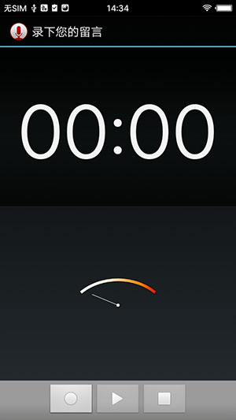

## SoundRecorder
    这是一个android4.4.4上的录音源码, 这个程序是供其它APP调用的,
    因为这个activity在manifest中配置是没有launcher的,只有一个main入口, 后来自己加了一个launcher的category

    <intent-filter>
        <action android:name="android.intent.action.MAIN" />
        <category android:name="android.intent.category.LAUNCHER"/>
    </intent-filter>

    case R.id.acceptButton:
        mRecorder.stop();
        /**
         * 这个项目, 本来就是为其它项目服务的. 因为这个项目本来就不是launcher, 仅仅有一个main入口
         */
        saveSample();
        //finish();
        break;

    /*
     * If we have just recorded a smaple, this adds it to the media data base
     * and sets the result to the sample's URI.
     */
    private void saveSample() {
        if (mRecorder.sampleLength() == 0)
            return;
        Uri uri = null;
        try {
            uri = this.addToMediaDB(mRecorder.sampleFile());
        } catch(UnsupportedOperationException ex) {  // Database manipulation failure
            return;
        }
        if (uri == null) {
            return;
        }
        setResult(RESULT_OK, new Intent().setData(uri));
    }

